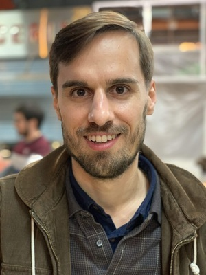

---
#
# By default, content added below the "---" mark will appear in the home page
# between the top bar and the list of recent posts.
# To change the home page layout, edit the _layouts/home.html file.
# See: https://jekyllrb.com/docs/themes/#overriding-theme-defaults
#
layout: home
---

Links:

I am a Research Associate and a PhD candidate in the [Database Systems (DIMA)](https://www.tu.berlin/en/dima) group at [TU Berlin](https://www.tu.berlin/) mentored by [Volker Markl](https://www.bifold.berlin/people/prof-dr-volker-markl.html) and [Jorge Quiané-Ruiz](https://itu.dk/~joqu/). 

My current research has been focusing on confidential computing in data processing systems, privacy-preserving cloud systems, and modern hardware.

Before joining TU Berlin as a researcher, I completed an [EIT](https://www.eitdigital.eu/) double M.Sc. at TU Berlin and [UPM Madrid](https://www.upm.es/). During my Master's thesis, I collaborated with [Logical Clocks](https://logicalclocks.com) in Stockholm and developed infrastructure to enable streaming IoT data pipelines in [Hopsworks](https://www.hopsworks.ai/).

## Publications
### Full Papers
* **Cracking-Like Join for Trusted Execution Environments**\
*Kajetan Maliszewski, Jorge-Arnulfo Quiané-Ruiz, Volker Markl*\
PVLDB '23. [paper.](assets/p2330-maliszewski.pdf) [code.](https://github.com/kai-chi/CrkJoin) [slides.](assets/2023-vldb-crkj-presentation.pdf) [poster.](assets/2023-vldb-crkj-poster.jpg)
* **What Is the Price for Joining Securely? Benchmarking Equi-Joins in Trusted Execution Environments**\
*Kajetan Maliszewski, Jorge-Arnulfo Quiané-Ruiz, Jonas Traub, Volker Markl*\
PVLDB '21. [paper.](assets/p659-maliszewski.pdf) [code.](https://github.com/agora-ecosystem/tee-bench) [video.](https://www.youtube.com/watch?v=fx3TLVXXdyo) [slides.](assets/2022-vldb-presentation.pdf) [poster.](assets/2022-vldb-poster.jpg) [reproducibility.](https://www.tu.berlin/en/dima/news-details/ein-artikel-von-dima-forschern-wurde-mit-dem-vldb-reproducibility-badge-ausgezeichnet)

### Others
* **Privacy-Preserving Joins in Untrusted Environments**\
*Kajetan Maliszewski*\
Ph.D. thesis, Technische Universität Berlin, April 2025. [library.](https://depositonce.tu-berlin.de/items/637f6c78-fef4-480f-a99c-1bd7ce958acc) [slides.](https://kai-chi.github.io/assets/phd-defense-presentation.pdf)
* **TeeBench: Seamless Benchmarking in Trusted Execution Environments**\
*Kajetan Maliszewski, Tilman Dietzel, Jorge-Arnulfo Quiné-Ruiz, Volker Markl*\
SIGMOD '23 (demo). [paper.](https://dl.acm.org/doi/10.1145/3555041.3589726) [website.](https://teebench.dima.tu-berlin.de) [poster.](assets/2023-sigmod-poster.jpg)
* **Secure Data Processing at Scale**\
*Kajetan Maliszewski*\
PhD Workshop @ VLDB '20. [paper.](http://ceur-ws.org/Vol-2652/paper07.pdf) [slides.](https://kai-chi.github.io/assets/2020_phd_vldb_slides.pdf) [video.](https://www.youtube.com/watch?v=wSNN64zvSFA)

## Thesis Supervision
* Evaluating Relational Joins with SIMD Instructions in Intel SGX Enclaves, *Cong Dung Nguyen*
* EnclOPE: Enclave-Protected State for Order Preserving Encryption, *Tilman Dietzel*
* Leveraging Distributed Joins in Trusted Execution Environments, *Leonhard Rose*

## Teaching
* Database Lab ([DBPRA](https://moseskonto.tu-berlin.de/moses/modultransfersystem/bolognamodule/beschreibung/anzeigen.html?nummer=40400&version=8&sprache=2)), TU Berlin : WS22/23, SS23, WS23/24, SS24, WS24/25
* Big Data Systems Project ([BDSPRO](https://moseskonto.tu-berlin.de/moses/modultransfersystem/bolognamodule/beschreibung/anzeigen.html?nummer=40494&version=7&sprache=2)), TU Berlin : WS21/22
* Big Data Analytics Seminar ([BDASEM](https://moseskonto.tu-berlin.de/moses/modultransfersystem/bolognamodule/beschreibung/anzeigen.html?nummer=40353&version=9&sprache=2)), TU Berlin  : SS21, SS22
* ROC Foundations for Graduate Research in Data Management and Machine Learning Systems ([ROC](https://moseskonto.tu-berlin.de/moses/modultransfersystem/bolognamodule/beschreibung/anzeigen.html?nummer=41135&version=4&sprache=2)), TU Berlin : WS20/21
* Advanced Topics in Database and Information Systems Seminar ([DBSEM](https://moseskonto.tu-berlin.de/moses/modultransfersystem/bolognamodule/beschreibung/anzeigen.html?nummer=40402&version=8&sprache=2)), TU Berlin : SS20, WS21/22, SS22, SS25

## Invited Talks and Presentations
* Privacy-Preserving Joins in Untrusted Environments, *Boston University*, March 2025
* Secure Joins using TEEs, *NVIDIA*, October 2024
<!-- * Cracking-Like Join for Trusted Execution Environments, *VLDB'23, Vancouver, Canada*, August 2023 -->
* Secure Databases with TEEs, *UC Santa Cruz*, July 2023
<!-- * TeeBench: Seamless Benchmarking in TEEs (demo), *SIGMOD'23, Seattle, USA*, June 2023 -->
* Relational Joins in TEEs, *Singapore University of Technology and Design (SUTD)*, September 2022
<!-- * What Is the Price for Joining Securely? Benchmarking Equi-Joins in TEEs, *VLDB'22, Sydney, Australia* -->
<!-- * Secure Data Processing at Scale, *PhD@VLDB'20*, August 2020 -->

## Service
* 2024 - SIGMOD (external), VLDBJ, AsiaCCS (external)
* 2023 - ICDE (external), SIGMOD (external, availability) 
* 2021 - VLDB (external)

Also, check if there is something interesting in [Posts](/posts)!

